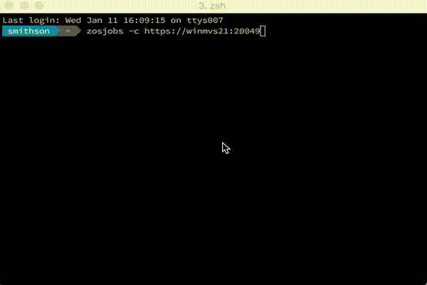

# zosjobs command

[](https://travis-ci.org/crshnburn/zosjobs)
[](https://codecov.io/gh/crshnburn/zosjobs)

Command line tool to retrieve z/OS Job Output and display on the console.

Makes use of the [zOSMF REST API](https://www.ibm.com/support/knowledgecenter/SSLTBW_2.1.0/com.ibm.zos.v2r1.izua700/IZUHPINFO_API_RESTJOBS.htm).



## Installation

1. `npm install -g zosjobs`

## Usage

```text
  Usage: zosjobs [options]

  Options:

    -h, --help                 output usage information
    -V, --version              output the version number
    -c, --connUrl [url]        specifies the z/OS MF hostname and port
    -u, --user [user]          specifies the user ID
    -p, --password [password]  specifies the password
    -o, --owner [owner]        the owner of the jobs to retrieve
```

## License

```text
Licensed under the Apache License, Version 2.0 (the "License");
you may not use this file except in compliance with the License.
You may obtain a copy of the License at

    http://www.apache.org/licenses/LICENSE-2.0

Unless required by applicable law or agreed to in writing, software
distributed under the License is distributed on an "AS IS" BASIS,
WITHOUT WARRANTIES OR CONDITIONS OF ANY KIND, either express or implied.
See the License for the specific language governing permissions and
limitations under the License.
```